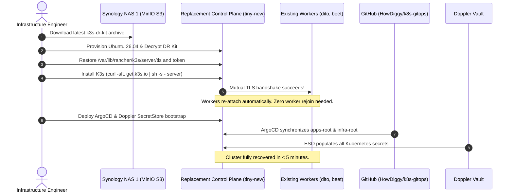

# Milestone Implementation Plan: K3s Kubernetes Backup & Disaster Recovery Architecture

**Target Repository:** `HowDiggy/k8s-gitops`  
**Target Infrastructure:** K3s Homelab (`home`) on Ubuntu Server 26.04 LTS  
* **Control Plane Node:** `tiny` (`192.168.1.57`, fanless 2-core x86_64, embedded SQLite/Kine datastore)  
* **Worker Nodes:** `dito` (`192.168.1.58`, laptop x86_64), `beet` (`192.168.1.59`, laptop x86_64)  
* **Storage Engine:** OpenEBS Dynamic LocalPV (`openebs-hostpath`, ext4/xfs, node-bound RWO)  
* **Stateful Engines:** CloudNativePG (`postgresql.cnpg.io/v1`), SQLite (Calibre-Web), MongoDB Community Operator (`mongodbcommunity.mongodb.com/v1`), Qdrant Vector DB (`qdrant.com`)  
* **Secret Management:** Doppler Cloud Vault via External Secrets Operator (`ClusterSecretStore/doppler-backend`)  
* **GitOps Engine:** In-cluster ArgoCD managing `clusters/home/apps-root.yaml` and `clusters/home/infra-root.yaml`  
* **Backup Destination:** Dual Synology NAS infrastructure on local LAN (Primary NAS 1: `192.168.1.100`, Secondary NAS 2: `192.168.1.200`, Offsite Cloud: OCI / Backblaze B2)

---

## 1. Architectural Overview & Mental Models

### 1.1 First-Principles Mental Models

Designing an enterprise-grade backup and disaster recovery (BDR) strategy for a hybrid, resource-constrained Kubernetes homelab requires grounding every design decision in three first principles:

```
+----------------------------------------------------------------------------------------------------+
|                                    THE GITOPS INVERSION PRINCIPLE                                  |
+----------------------------------------------------------------------------------------------------+
|  Cluster Configuration != State                                                                    |
|  * Deployments, Services, HTTPRoutes, NetworkPolicies, HelmReleases = Ephemeral Code (Git)         |
|  * Credentials, TLS certs, API tokens = Vault Code (Doppler + External Secrets Operator)           |
|                                                                                                    |
|  True Unrecoverable State:                                                                         |
|  1. Relational & Document Data: PostgreSQL Write-Ahead Logs & base backups, MongoDB oplog/data.    |
|  2. Embedded Database Files: Calibre-Web SQLite files (app.db, metadata.db).                       |
|  3. LocalPV Media Assets: Recipe photos (/app/data), e-book EPUBs (/books).                        |
|  4. Root Cryptographic Identity: K3s Server CA keys and static node registration tokens.           |
+----------------------------------------------------------------------------------------------------+
```

#### 1. The GitOps Inversion Principle
In standard bare-metal infrastructure, disaster recovery focuses on taking image-level or hypervisor snapshots of virtual machines. In a GitOps-driven Kubernetes cluster, taking whole-node or VM snapshots is an anti-pattern:
- Snapshotting active databases running on node-local filesystems causes page tearing and WAL divergence.
- Whole-node snapshots snapshot ephemeral etcd/SQLite leases, stale flannel/Cilium endpoint IPs, and dead container runtimes.
- Rebuilding from Git ensures zero configuration drift and guarantees that the cluster state matches the audit log in version control.
- Therefore, backup operations must target **only persistent state and root cryptographic identities**, letting ArgoCD reconstruct the remaining 95% of the cluster in minutes.

#### 2. The Storage Concurrency & File-Locking Paradox (OpenEBS LocalPV)
OpenEBS LocalPV (`openebs-hostpath`) binds volumes directly to the host filesystem (`/var/openebs/local/`).
- Volumes are strictly node-bound (`nodeAffinity`). There is no distributed storage fabric (e.g., Ceph or Longhorn) capable of instantaneous CSI snapshot orchestration.
- Kubernetes access mode `ReadWriteOnce` (RWO) indicates **read-write by a single node**, not a single pod. Backup pods scheduled on the *same physical node* can mount the volume concurrently with the application pod.
- However, live file copies of running SQLite databases (`app.db`, `metadata.db`) or active database engines while dirty pages reside in memory produce corrupted backups (`SQLITE_CORRUPT`). Application-consistent hooks (such as SQLite's atomic `VACUUM INTO` API) must decouple active writes from backup streams.

#### 3. The 3-2-1 Enterprise Homelab Topology
To achieve enterprise durability without enterprise SAN hardware costs:
- **3 Copies of Data:** Primary NVMe/SATA volume on worker node, primary backup copy on Synology NAS 1 (MinIO S3), secondary replicated copy on Synology NAS 2.
- **2 Different Storage Media / Protocols:** Local host ext4/xfs storage for low-latency transactions; Btrfs RAID with immutable snapshots over S3 Object Storage API for archival.
- **1 Offsite Copy:** Encrypted weekly cloud sync from Synology NAS 2 to offsite cloud storage (Backblaze B2 or OCI Always-Free Object Storage) via Synology Hyper Backup.

---

### 1.2 End-to-End System Architecture Diagram

```mermaid
graph TD
    subgraph K3S ["K3s Cluster (Compute & Local Storage)"]
        subgraph CP ["Control Plane Node: 'tiny' (192.168.1.57)"]
            K3S_SRV["K3s Server Process"]
            K3S_DB["Embedded SQLite (state.db)"]
            K3S_TLS["CA Keys & Cluster Tokens\n(/var/lib/rancher/k3s/server/tls, token)"]
            DR_TIMER["Systemd Timer: k3s-dr-kit.service"]
        end

        subgraph WORKERS ["Worker Nodes: 'dito' (192.168.1.58) & 'beet' (192.168.1.59)"]
            subgraph MEALIE_NS ["Namespace: mealie"]
                POD_MEALIE["Pod: mealie (app)"]
                PVC_MEALIE_DATA["OpenEBS LocalPV: mealie-data-pvc\n(/app/data)"]
                CNPG_MEALIE["CNPG Instance: mealie-db\n(PostgreSQL 16)"]
                JOB_MEALIE_MEDIA["CronJob: mealie-media-backup\n(Kopia Engine)"]
            end

            subgraph CALIBRE_NS ["Namespace: calibre-web"]
                POD_CALIBRE["Pod: calibre-web (app)"]
                PVC_CALIBRE_CFG["OpenEBS LocalPV: calibre-web-config-pvc\n(/config/app.db)"]
                PVC_CALIBRE_BOOKS["OpenEBS LocalPV: calibre-web-books-pvc\n(/books/metadata.db)"]
                JOB_CALIBRE["CronJob: calibre-web-backup\n(SQLite VACUUM + Kopia)"]
            end

            subgraph SECONDARY_NS ["Namespaces: mongodb & qdrant"]
                MONGO_PODS["MongoDB 3-Node ReplicaSet"]
                JOB_MONGO["CronJob: mongodb-backup\n(mongodump --oplog on Secondary)"]
                QDRANT_PODS["Qdrant Vector DB Pods"]
                JOB_QDRANT["CronJob: qdrant-backup\n(REST Snapshot Streamer)"]
            end
        end
    end

    subgraph DOPPLER_VAULT ["Secret Ingestion"]
        DOPPLER["Doppler Vault: project k8s-eso / config dev"]
        ESO["External Secrets Operator (ClusterSecretStore)"]
        DOPPLER --> ESO
        ESO -.->|Reconciles S3 & Kopia Keys| MEALIE_NS
        ESO -.->|Reconciles S3 & Kopia Keys| CALIBRE_NS
        ESO -.->|Reconciles S3 & Dump Keys| SECONDARY_NS
    end

    subgraph NAS1 ["Primary Storage: Synology NAS 1 (192.168.1.100)"]
        MINIO["MinIO S3 Gateway (Container Manager)\nPort 9000 (API) / 9001 (Console)"]
        B1["Bucket: cnpg-backups\n(WAL Archive & Base Backups)"]
        B2["Bucket: k8s-kopia-backups\n(Deduplicated LocalPV Snapshots)"]
        B3["Bucket: mongo-backups"]
        B4["Bucket: qdrant-backups"]
        B5["Bucket: k3s-controlplane-backups"]
        NAS1_BTRFS["Btrfs Storage Pool (RAID)"]
        MINIO --> B1 & B2 & B3 & B4 & B5
        B1 & B2 & B3 & B4 & B5 --> NAS1_BTRFS
    end

    subgraph NAS2 ["Secondary Storage: Synology NAS 2 (192.168.1.200)"]
        NAS2_REP["Btrfs Snapshot Replication Receiver\n(Hourly Read-Only Immutable Snapshots)"]
        HYPER_BACKUP["Synology Hyper Backup Engine\n(Client-side AES-256 Encryption)"]
    end

    subgraph OFFSITE ["Offsite Disaster Recovery (Cloud)"]
        CLOUD_S3["Cloud Object Storage\n(Backblaze B2 / OCI Object Storage)"]
    end

    %% Data Flows
    DR_TIMER -->|Daily Encrypted Tarball| B5
    CNPG_MEALIE -->|Continuous WAL Streaming & Nightly Base| B1
    JOB_MEALIE_MEDIA -->|Deduplicated Incrementals| B2
    JOB_CALIBRE -->|Atomic VACUUM + Deduplicated Incrementals| B2
    JOB_MONGO -->|Streaming Gzip Archive| B3
    JOB_QDRANT -->|Collection Snapshots| B4

    NAS1_BTRFS -->|Hourly Delta Replication| NAS2_REP
    NAS2_REP -->|Weekly Encrypted Incremental| HYPER_BACKUP
    HYPER_BACKUP -->|WAN Sync| CLOUD_S3
```



---

### 1.3 Service Level Objectives (SLOs): RPO & RTO Matrix

| Workload / Component | Primary Engine | Target RPO (Data Loss Tolerance) | Target RTO (Downtime Tolerance) | Consistency Guarantee | Backup Frequency |
| :--- | :--- | :--- | :--- | :--- | :--- |
| **Mealie PostgreSQL** | CloudNativePG (Barman Cloud) | **< 5 minutes** (Real-time WAL streaming) | **< 10 minutes** | Transactional & PITR | Continuous WAL + Daily Base at 02:00 UTC |
| **MLflow PostgreSQL** | CloudNativePG (Barman Cloud) | **< 5 minutes** (Real-time WAL streaming) | **< 10 minutes** | Transactional & PITR | Continuous WAL + Daily Base at 02:30 UTC |
| **Calibre-Web SQLite** | Native `VACUUM INTO` + Kopia | **24 hours** | **< 10 minutes** | Application-Consistent Atomic Snapshot | Daily at 03:00 UTC |
| **Mealie Media (`/app/data`)** | Kopia Standalone CronJob | **24 hours** | **< 15 minutes** | File-level Incremental Snapshot | Daily at 03:30 UTC |
| **Calibre Books (`/books`)** | Kopia Standalone CronJob | **24 hours** | **< 20 minutes** | File-level Incremental Snapshot | Daily at 03:00 UTC |
| **MongoDB ReplicaSet** | `mongodump --oplog` CronJob | **24 hours** (Point-in-Time oplog) | **< 15 minutes** | Document Consistent (Replica Secondary) | Daily at 04:00 UTC |
| **Qdrant Vector DB** | Qdrant REST API Snapshots | **24 hours** | **< 15 minutes** | Collection Consistent Snapshot | Daily at 04:30 UTC |
| **K3s Control Plane (`tiny`)** | K3s DR Kit (CA/Tokens/Token-file) | **Zero drift** (GitOps) / **30 days** for CA | **< 5 minutes** | Full cryptographic identity parity | Weekly / On-Change at 01:00 UTC |

---

## 2. Milestone 1: Synology NAS Infrastructure Setup & Storage Architecture

### 2.1 Overview & Prerequisites
* **Synology NAS 1 (Primary):** IP `192.168.1.100`, running DSM 7.2+, Btrfs volume mounted at `/volume1`.
* **Synology NAS 2 (Secondary):** IP `192.168.1.200`, running DSM 7.2+, Btrfs volume mounted at `/volume1`.
* **Network:** Local 1GbE/2.5GbE switch, non-routable homelab VLAN.

---

### 2.2 Step 1: Deploy MinIO S3 Gateway on Synology NAS 1

On Synology NAS 1, open **Container Manager** (or SSH) and deploy MinIO using Docker Compose to serve as the unified, S3-compliant target for CloudNativePG and Kopia.

#### `/volume1/docker/minio/docker-compose.yaml`
```yaml
version: '3.8'

services:
  minio:
    image: quay.io/minio/minio:RELEASE.2024-08-03T04-33-23Z
    container_name: k8s-minio-s3
    restart: always
    command: server /data --console-address ":9001" --address ":9000"
    environment:
      MINIO_ROOT_USER: "syno-admin"
      MINIO_ROOT_PASSWORD: "REPLACE_WITH_SECURE_ADMIN_PASSWORD"
      MINIO_BROWSER_REDIRECT_URL: "http://192.168.1.100:9001"
      MINIO_SERVER_URL: "http://192.168.1.100:9000"
    volumes:
      - /volume1/k8s-backups/minio-data:/data
    ports:
      - "9000:9000"
      - "9001:9001"
    healthcheck:
      test: ["CMD", "mc", "ready", "local"]
      interval: 30s
      timeout: 5s
      retries: 3
```

#### Bucket Creation and Lifecycle Layout
Execute via the MinIO Client (`mc`) on NAS 1 or the web console (`http://192.168.1.100:9001`):

```bash
# Configure local alias
mc alias set local http://localhost:9000 syno-admin <ADMIN_PASSWORD>

# Create isolated service buckets
mc mb local/cnpg-backups
mc mb local/k8s-kopia-backups
mc mb local/mongo-backups
mc mb local/qdrant-backups
mc mb local/k3s-controlplane-backups

# Enable versioning on K3s controlplane bucket for historical rollback
mc version enable local/k3s-controlplane-backups

# Create dedicated, least-privilege service account for Kubernetes workers
mc admin user add local k8s-backup-agent "REPLACE_WITH_GENERATED_SECRET_KEY"

# Attach read-write policy scoped strictly to backup buckets
cat <<EOF > /tmp/k8s-backup-policy.json
{
  "Version": "2012-10-17",
  "Statement": [
    {
      "Effect": "Allow",
      "Action": ["s3:*"],
      "Resource": [
        "arn:aws:s3:::cnpg-backups*",
        "arn:aws:s3:::k8s-kopia-backups*",
        "arn:aws:s3:::mongo-backups*",
        "arn:aws:s3:::qdrant-backups*",
        "arn:aws:s3:::k3s-controlplane-backups*"
      ]
    }
  ]
}
EOF

mc admin policy create local K8sBackupPolicy /tmp/k8s-backup-policy.json
mc admin policy attach local K8sBackupPolicy --user k8s-backup-agent
rm -f /tmp/k8s-backup-policy.json
```

---

### 2.3 Step 2: Ingest Backup Secrets into Doppler

All Kubernetes secrets are managed centrally through the Doppler Cloud Vault (`project: k8s-eso`, `config: dev`). Populate the required credentials using the Doppler CLI:

```bash
# Generate high-entropy keys
KOPIA_KEY=$(openssl rand -base64 32)
S3_ACCESS_KEY="k8s-backup-agent"
S3_SECRET_KEY="<GENERATED_SECRET_KEY>"

# Set secrets in Doppler project
doppler secrets set \
  BACKUP_S3_ENDPOINT="http://192.168.1.100:9000" \
  BACKUP_S3_ACCESS_KEY="${S3_ACCESS_KEY}" \
  BACKUP_S3_SECRET_KEY="${S3_SECRET_KEY}" \
  KOPIA_ENCRYPTION_KEY="${KOPIA_KEY}" \
  --project k8s-eso \
  --config dev
```

---

### 2.4 Step 3: Configure Multi-NAS 3-2-1 Topology

#### 1. Real-Time Local Redundancy (NAS 1 -> NAS 2 via Btrfs Snapshot Replication)
1. In Synology DSM on NAS 1, open **Snapshot Replication**.
2. Navigate to **Replication** > **Shared Folder** > Select `k8s-backups`.
3. Click **Create** and select **Remote Destination** (`192.168.1.200`, NAS 2).
4. **Schedule:** Select **Hourly** replication.
5. **Retention Policy:**
   - Keep latest 24 hourly snapshots.
   - Keep 7 daily snapshots.
   - Keep 4 weekly snapshots.
6. Check **Enable snapshot encryption** if transfer passes over untrusted segments.

#### 2. Offsite Cloud Redundancy (NAS 2 -> Cloud via Hyper Backup)
1. On Synology NAS 2, open **Hyper Backup**.
2. Click **+ Create Backup Task** > **S3 Storage** (Target: Backblaze B2 or OCI Object Storage S3 Endpoint).
3. **Source Directory:** Select the replicated read-only shared folder `k8s-backups`.
4. **Encryption:** Check **Enable client-side encryption** and enter a 32-character encryption passphrase (stored in Doppler and safe 1Password vault).
5. **Schedule:** Run weekly on Sunday at 04:00 UTC.
6. **Integrity Check:** Enable weekly backup integrity check with index scrubbing.

---

## 3. Milestone 2: CloudNativePG Continuous WAL Archiving & ScheduledBackups

### 3.1 Technical Mental Model & Upstream Resolution

CloudNativePG manages PostgreSQL through continuous physical backup orchestration using EnterpriseDB Barman Cloud tools:
- **Continuous WAL Archiving (`barman-cloud-wal-archive`):** Every completed 16MB PostgreSQL WAL file (or partial segment triggered by `archive_timeout: "300s"`) is compressed and uploaded to MinIO over HTTP. This prevents data loss between daily snapshots.
- **Base Backups (`barman-cloud-backup`):** Coordinated physical backup snapshots executed while the database remains online.
- **Upstream Deprecation Protocol:** As of CloudNativePG v1.26.0+, the in-tree `spec.backup.barmanObjectStore` is deprecated and scheduled for removal in v1.31.0. Both the current in-tree specification and the forward-compatible `plugin-barman-cloud` target the same S3 MinIO buckets identically. We provide the production-ready in-tree configuration and include the migration blueprint.

---

### 3.2 Kubernetes GitOps Manifests

#### 1. Secret Ingestion: `apps/base/mealie/01-external-secret.yaml`
Extend the existing ExternalSecret to sync the S3 backup credentials:

```yaml
apiVersion: external-secrets.io/v1beta1
kind: ExternalSecret
metadata:
  name: cnpg-s3-backup-credentials
  namespace: mealie
spec:
  refreshInterval: 1h
  secretStoreRef:
    name: doppler-backend
    kind: ClusterSecretStore
  target:
    name: cnpg-s3-backup-credentials
    creationPolicy: Owner
  data:
    - secretKey: ACCESS_KEY_ID
      remoteRef:
        key: BACKUP_S3_ACCESS_KEY
    - secretKey: ACCESS_SECRET_KEY
      remoteRef:
        key: BACKUP_S3_SECRET_KEY
```

*(Identical manifest applied to `apps/base/mlflow/01-external-secret.yaml` under namespace `mlflow`).*

#### 2. Update CloudNativePG Cluster: `apps/base/mealie/03-postgres-cluster.yaml`

```yaml
apiVersion: postgresql.cnpg.io/v1
kind: Cluster
metadata:
  name: mealie-db
  namespace: mealie
  labels:
    app.kubernetes.io/name: mealie
    app.kubernetes.io/component: database
spec:
  instances: 1
  primaryUpdateStrategy: unsupervised
  storage:
    size: 5Gi
    storageClass: openebs-hostpath
  bootstrap:
    initdb:
      database: mealie
      owner: mealie_user
      secret:
        name: mealie-db-credentials

  # PostgreSQL Runtime Parameters for Continuous Streaming
  postgresql:
    parameters:
      archive_timeout: "300s" # Flush WAL every 5 minutes during idle periods

  # Backup & Continuous WAL Archiving Configuration
  backup:
    retentionPolicy: "30d"
    barmanObjectStore:
      destinationPath: "s3://cnpg-backups/mealie-db"
      endpointURL: "http://192.168.1.100:9000"
      s3Credentials:
        accessKeyId:
          name: cnpg-s3-backup-credentials
          key: ACCESS_KEY_ID
        secretAccessKey:
          name: cnpg-s3-backup-credentials
          key: ACCESS_SECRET_KEY
      wal:
        compression: gzip
        maxParallel: 2
      data:
        compression: gzip
        jobs: 2
```

#### 3. Declarative Backup Schedule: `apps/base/mealie/07-scheduled-backup.yaml`

```yaml
apiVersion: postgresql.cnpg.io/v1
kind: ScheduledBackup
metadata:
  name: mealie-db-daily-backup
  namespace: mealie
spec:
  schedule: "0 0 2 * * *" # Daily at 02:00 UTC
  backupOwnerReference: self
  cluster:
    name: mealie-db
```

*(Mirror this configuration for `mlflow-db` in `apps/base/mlflow/03-postgres-cluster.yaml` and `apps/base/mlflow/05-scheduled-backup.yaml` scheduled at `0 30 2 * * *`).*

---

### 3.3 Upstream Migration Blueprint: Barman Cloud Plugin (`CNPG-I`)

Prior to upgrading the cluster to CloudNativePG v1.31.0, transition from in-tree `barmanObjectStore` to the CNPG Barman Cloud Plugin:

```yaml
apiVersion: postgresql.cnpg.io/v1
kind: Cluster
metadata:
  name: mealie-db
  namespace: mealie
spec:
  instances: 1
  # Plugins declaration replaces in-tree .spec.backup.barmanObjectStore
  plugins:
    - name: barman-cloud.cloudnative-pg.io
      parameters:
        backup: "true"
        walArchive: "true"
        destinationPath: "s3://cnpg-backups/mealie-db"
        endpointURL: "http://192.168.1.100:9000"
        s3Credentials:
          accessKeyId:
            name: cnpg-s3-backup-credentials
            key: ACCESS_KEY_ID
          secretAccessKey:
            name: cnpg-s3-backup-credentials
            key: ACCESS_SECRET_KEY
        wal:
          compression: gzip
        data:
          compression: gzip
```

---

## 4. Milestone 3: OpenEBS LocalPV Application-Consistent Backup Modules

### 4.1 Technical Mental Model: Why Kopia Standalone CronJobs?

OpenEBS LocalPV volumes are node-local hostpaths. To back them up reliably:
1. **Velero with Node-Agent Limitations:** Velero's DaemonSet incurs continuous ~800MB–1.2GB cluster RAM overhead, introduces brittle host filesystem bind-mounts into `/var/lib/kubelet/pods`, and frequently crashes if pods recreate during a backup pass.
2. **Kopia Standalone Architecture:** Running Kopia in scheduled Kubernetes `CronJobs` consumes **0 MB idle RAM**. Pods are spun up only during the backup window.
3. **Node Scheduling Guarantee (`podAffinity`):** Because OpenEBS LocalPV volumes are bound to the node where the application pod runs, the backup CronJob specifies a strict `podAffinity` matching the application's pod labels. This guarantees the backup pod schedules on the exact host possessing the physical volume files.
4. **Application Consistency for SQLite:** Calibre-Web utilizes `/config/app.db` and `/books/metadata.db`. Merely copying these files results in `SQLITE_CORRUPT` if writes are buffered in memory or WAL journal. The backup script executes atomic `sqlite3 <db> "VACUUM INTO '/tmp/backup.db'"` before pushing to S3.

---

### 4.2 Module 3A: Calibre-Web Consistent SQLite & Media Backup

Create `apps/overlays/home/calibre-web/backup-cronjob.yaml`:

```yaml
apiVersion: external-secrets.io/v1beta1
kind: ExternalSecret
metadata:
  name: calibre-backup-credentials
  namespace: calibre-web
spec:
  refreshInterval: 1h
  secretStoreRef:
    name: doppler-backend
    kind: ClusterSecretStore
  target:
    name: calibre-backup-credentials
    creationPolicy: Owner
  data:
    - secretKey: KOPIA_PASSWORD
      remoteRef:
        key: KOPIA_ENCRYPTION_KEY
    - secretKey: AWS_ACCESS_KEY_ID
      remoteRef:
        key: BACKUP_S3_ACCESS_KEY
    - secretKey: AWS_SECRET_ACCESS_KEY
      remoteRef:
        key: BACKUP_S3_SECRET_KEY
---
apiVersion: batch/v1
kind: CronJob
metadata:
  name: calibre-web-backup
  namespace: calibre-web
spec:
  schedule: "0 3 * * *" # Daily at 03:00 UTC
  concurrencyPolicy: Forbid
  successfulJobsHistoryLimit: 3
  failedJobsHistoryLimit: 5
  jobTemplate:
    spec:
      template:
        metadata:
          labels:
            app.kubernetes.io/component: backup
        spec:
          restartPolicy: OnFailure
          # Enforce co-location on the worker node hosting the LocalPV volumes
          affinity:
            podAffinity:
              requiredDuringSchedulingIgnoredDuringExecution:
                - labelSelector:
                    matchExpressions:
                      - key: app
                        operator: In
                        values: ["calibre-web"]
                  topologyKey: "kubernetes.io/hostname"
          containers:
            - name: kopia-backup
              image: kopia/kopia:0.17.0
              env:
                - name: KOPIA_PASSWORD
                  valueFrom:
                    secretKeyRef:
                      name: calibre-backup-credentials
                      key: KOPIA_PASSWORD
                - name: AWS_ACCESS_KEY_ID
                  valueFrom:
                    secretKeyRef:
                      name: calibre-backup-credentials
                      key: AWS_ACCESS_KEY_ID
                - name: AWS_SECRET_ACCESS_KEY
                  valueFrom:
                    secretKeyRef:
                      name: calibre-backup-credentials
                      key: AWS_SECRET_ACCESS_KEY
                - name: KOPIA_CACHE_DIRECTORY
                  value: /tmp/kopia-cache
                - name: KOPIA_CONFIG_PATH
                  value: /tmp/kopia.config
              command:
                - /bin/sh
                - -c
                - |
                  set -eo pipefail
                  echo "=== Step 1: Performing Application-Consistent SQLite Snapshots ==="
                  apk add --no-cache sqlite
                  mkdir -p /tmp/sqlite-export

                  if [ -f /config/app.db ]; then
                    sqlite3 /config/app.db "VACUUM INTO '/tmp/sqlite-export/app.db';"
                    echo "Flushed /config/app.db safely."
                  fi

                  if [ -f /books/metadata.db ]; then
                    sqlite3 /books/metadata.db "VACUUM INTO '/tmp/sqlite-export/metadata.db';"
                    echo "Flushed /books/metadata.db safely."
                  fi

                  echo "=== Step 2: Connecting / Initializing Kopia Repository ==="
                  kopia repository connect s3 \
                    --bucket=k8s-kopia-backups \
                    --endpoint=192.168.1.100:9000 \
                    --prefix=calibre-web/ \
                    --disable-tls || \
                  kopia repository create s3 \
                    --bucket=k8s-kopia-backups \
                    --endpoint=192.168.1.100:9000 \
                    --prefix=calibre-web/ \
                    --disable-tls

                  echo "=== Step 3: Snapshotting Application Data & Media ==="
                  kopia snapshot create /tmp/sqlite-export
                  kopia snapshot create /books --exclude="metadata.db"

                  echo "=== Step 4: Enforcing Retention & Pruning ==="
                  kopia policy set /tmp/sqlite-export --keep-daily 14 --keep-weekly 4 --keep-monthly 6
                  kopia policy set /books --keep-daily 7 --keep-weekly 4 --keep-monthly 3

                  echo "Calibre-Web backup cycle completed successfully."
              volumeMounts:
                - name: config-volume
                  mountPath: /config
                  readOnly: true
                - name: books-volume
                  mountPath: /books
                  readOnly: true
          volumes:
            - name: config-volume
              persistentVolumeClaim:
                claimName: calibre-web-config-pvc
            - name: books-volume
              persistentVolumeClaim:
                claimName: calibre-web-books-pvc
```

---

### 4.3 Module 3B: Mealie Static Asset Backup Module

Create `apps/overlays/home/mealie/media-backup-cronjob.yaml`:

```yaml
apiVersion: external-secrets.io/v1beta1
kind: ExternalSecret
metadata:
  name: mealie-backup-credentials
  namespace: mealie
spec:
  refreshInterval: 1h
  secretStoreRef:
    name: doppler-backend
    kind: ClusterSecretStore
  target:
    name: mealie-backup-credentials
    creationPolicy: Owner
  data:
    - secretKey: KOPIA_PASSWORD
      remoteRef:
        key: KOPIA_ENCRYPTION_KEY
    - secretKey: AWS_ACCESS_KEY_ID
      remoteRef:
        key: BACKUP_S3_ACCESS_KEY
    - secretKey: AWS_SECRET_ACCESS_KEY
      remoteRef:
        key: BACKUP_S3_SECRET_KEY
---
apiVersion: batch/v1
kind: CronJob
metadata:
  name: mealie-media-backup
  namespace: mealie
spec:
  schedule: "30 3 * * *" # Daily at 03:30 UTC
  concurrencyPolicy: Forbid
  successfulJobsHistoryLimit: 3
  failedJobsHistoryLimit: 5
  jobTemplate:
    spec:
      template:
        metadata:
          labels:
            app.kubernetes.io/component: backup
        spec:
          restartPolicy: OnFailure
          affinity:
            podAffinity:
              requiredDuringSchedulingIgnoredDuringExecution:
                - labelSelector:
                    matchExpressions:
                      - key: app.kubernetes.io/name
                        operator: In
                        values: ["mealie"]
                  topologyKey: "kubernetes.io/hostname"
          containers:
            - name: kopia-media-backup
              image: kopia/kopia:0.17.0
              env:
                - name: KOPIA_PASSWORD
                  valueFrom:
                    secretKeyRef:
                      name: mealie-backup-credentials
                      key: KOPIA_PASSWORD
                - name: AWS_ACCESS_KEY_ID
                  valueFrom:
                    secretKeyRef:
                      name: mealie-backup-credentials
                      key: AWS_ACCESS_KEY_ID
                - name: AWS_SECRET_ACCESS_KEY
                  valueFrom:
                    secretKeyRef:
                      name: mealie-backup-credentials
                      key: AWS_SECRET_ACCESS_KEY
                - name: KOPIA_CACHE_DIRECTORY
                  value: /tmp/kopia-cache
                - name: KOPIA_CONFIG_PATH
                  value: /tmp/kopia.config
              command:
                - /bin/sh
                - -c
                - |
                  set -eo pipefail
                  echo "=== Connecting to Kopia Repository ==="
                  kopia repository connect s3 \
                    --bucket=k8s-kopia-backups \
                    --endpoint=192.168.1.100:9000 \
                    --prefix=mealie-media/ \
                    --disable-tls || \
                  kopia repository create s3 \
                    --bucket=k8s-kopia-backups \
                    --endpoint=192.168.1.100:9000 \
                    --prefix=mealie-media/ \
                    --disable-tls

                  echo "=== Snapshotting /app/data Assets ==="
                  kopia snapshot create /app/data
                  kopia policy set /app/data --keep-daily 14 --keep-weekly 4
                  echo "Mealie media backup completed."
              volumeMounts:
                - name: mealie-media-volume
                  mountPath: /app/data
                  readOnly: true
          volumes:
            - name: mealie-media-volume
              persistentVolumeClaim:
                claimName: mealie-data-pvc
```

---

## 5. Milestone 4: Secondary Datastores (MongoDB ReplicaSet & Qdrant Snapshots)

### 5.1 Module 4A: MongoDB 3-Node ReplicaSet Backup Module

The MongoDB cluster (`infrastructure/base/mongodb-cluster`) runs as a 3-member ReplicaSet. Backing up the primary node degrades transactional throughput. The backup CronJob uses `--readPreference=secondaryPreferred` with `--oplog` to capture an application-consistent point-in-time state from a secondary replica.

Create `infrastructure/overlays/home/mongodb-cluster/backup-cronjob.yaml`:

```yaml
apiVersion: external-secrets.io/v1beta1
kind: ExternalSecret
metadata:
  name: mongo-backup-credentials
  namespace: mongodb
spec:
  refreshInterval: 1h
  secretStoreRef:
    name: doppler-backend
    kind: ClusterSecretStore
  target:
    name: mongo-backup-credentials
    creationPolicy: Owner
  data:
    - secretKey: MONGODB_ADMIN_PASSWORD
      remoteRef:
        key: MONGODB_ADMIN_PASSWORD
    - secretKey: AWS_ACCESS_KEY_ID
      remoteRef:
        key: BACKUP_S3_ACCESS_KEY
    - secretKey: AWS_SECRET_ACCESS_KEY
      remoteRef:
        key: BACKUP_S3_SECRET_KEY
---
apiVersion: batch/v1
kind: CronJob
metadata:
  name: mongodb-s3-backup
  namespace: mongodb
spec:
  schedule: "0 4 * * *" # Daily at 04:00 UTC
  concurrencyPolicy: Forbid
  jobTemplate:
    spec:
      template:
        spec:
          restartPolicy: OnFailure
          containers:
            - name: mongodump-s3
              image: amazon/aws-cli:2.17.40
              env:
                - name: MONGO_PASSWORD
                  valueFrom:
                    secretKeyRef:
                      name: mongo-backup-credentials
                      key: MONGODB_ADMIN_PASSWORD
                - name: AWS_ACCESS_KEY_ID
                  valueFrom:
                    secretKeyRef:
                      name: mongo-backup-credentials
                      key: AWS_ACCESS_KEY_ID
                - name: AWS_SECRET_ACCESS_KEY
                  valueFrom:
                    secretKeyRef:
                      name: mongo-backup-credentials
                      key: AWS_SECRET_ACCESS_KEY
                - name: AWS_ENDPOINT_URL
                  value: "http://192.168.1.100:9000"
              command:
                - /bin/bash
                - -c
                - |
                  set -eo pipefail
                  yum install -y tar gzip

                  # Install MongoDB Database Tools
                  curl -sSL https://fastdl.mongodb.org/tools/db/mongodb-database-tools-amazon2-x86_64-100.9.4.tgz | tar -xz -C /tmp/
                  export PATH=$PATH:/tmp/mongodb-database-tools-amazon2-x86_64-100.9.4/bin

                  BACKUP_NAME="mongodb-backup-$(date +%Y%m%d_%H%M%S).archive.gz"
                  echo "=== Initiating mongodump against Secondary ==="

                  mongodump \
                    --host="mongodb-svc.mongodb.svc.cluster.local:27017" \
                    --username="admin" \
                    --password="${MONGO_PASSWORD}" \
                    --authenticationDatabase="admin" \
                    --readPreference="secondaryPreferred" \
                    --oplog \
                    --gzip \
                    --archive="/tmp/${BACKUP_NAME}"

                  echo "=== Streaming Archive to MinIO S3 ==="
                  aws --endpoint-url="${AWS_ENDPOINT_URL}" s3 cp "/tmp/${BACKUP_NAME}" "s3://mongo-backups/${BACKUP_NAME}"

                  echo "=== Pruning Snapshots Older Than 30 Days ==="
                  rm -f "/tmp/${BACKUP_NAME}"
                  echo "MongoDB backup cycle complete."
```

---

### 5.2 Module 4B: Qdrant Vector Database REST Snapshot Module

Qdrant (`infrastructure/base/qdrant`) provides an internal snapshotting engine via HTTP API. Taking raw filesystem copies of live Qdrant memory-mapped vector indexes (HNSW) risks memory segment corruption.

Create `infrastructure/overlays/home/qdrant-backup-cronjob.yaml`:

```yaml
apiVersion: external-secrets.io/v1beta1
kind: ExternalSecret
metadata:
  name: qdrant-backup-credentials
  namespace: qdrant
spec:
  refreshInterval: 1h
  secretStoreRef:
    name: doppler-backend
    kind: ClusterSecretStore
  target:
    name: qdrant-backup-credentials
    creationPolicy: Owner
  data:
    - secretKey: QDRANT_API_KEY
      remoteRef:
        key: QDRANT_API_KEY
    - secretKey: AWS_ACCESS_KEY_ID
      remoteRef:
        key: BACKUP_S3_ACCESS_KEY
    - secretKey: AWS_SECRET_ACCESS_KEY
      remoteRef:
        key: BACKUP_S3_SECRET_KEY
---
apiVersion: batch/v1
kind: CronJob
metadata:
  name: qdrant-s3-backup
  namespace: qdrant
spec:
  schedule: "30 4 * * *" # Daily at 04:30 UTC
  concurrencyPolicy: Forbid
  jobTemplate:
    spec:
      template:
        spec:
          restartPolicy: OnFailure
          containers:
            - name: qdrant-snapshotter
              image: amazon/aws-cli:2.17.40
              env:
                - name: QDRANT_API_KEY
                  valueFrom:
                    secretKeyRef:
                      name: qdrant-backup-credentials
                      key: QDRANT_API_KEY
                - name: AWS_ACCESS_KEY_ID
                  valueFrom:
                    secretKeyRef:
                      name: qdrant-backup-credentials
                      key: AWS_ACCESS_KEY_ID
                - name: AWS_SECRET_ACCESS_KEY
                  valueFrom:
                    secretKeyRef:
                      name: qdrant-backup-credentials
                      key: AWS_SECRET_ACCESS_KEY
              command:
                - /bin/bash
                - -c
                - |
                  set -eo pipefail
                  yum install -y jq curl

                  QDRANT_HOST="http://qdrant.qdrant.svc.cluster.local:6333"
                  S3_ENDPOINT="http://192.168.1.100:9000"

                  echo "=== Step 1: Querying Active Collections ==="
                  COLLECTIONS=$(curl -s -H "api-key: ${QDRANT_API_KEY}" "${QDRANT_HOST}/collections" | jq -r '.result.collections[].name')

                  for COLL in $COLLECTIONS; do
                    echo "Creating snapshot for collection: ${COLL}..."
                    RESP=$(curl -s -X POST -H "api-key: ${QDRANT_API_KEY}" "${QDRANT_HOST}/collections/${COLL}/snapshots")
                    SNAP_NAME=$(echo "$RESP" | jq -r '.result.name')

                    echo "Downloading snapshot: ${SNAP_NAME}..."
                    curl -s -H "api-key: ${QDRANT_API_KEY}" \
                      "${QDRANT_HOST}/collections/${COLL}/snapshots/${SNAP_NAME}" \
                      -o "/tmp/${SNAP_NAME}"

                    echo "Uploading ${SNAP_NAME} to MinIO S3..."
                    aws --endpoint-url="${S3_ENDPOINT}" s3 cp "/tmp/${SNAP_NAME}" "s3://qdrant-backups/${COLL}/${SNAP_NAME}"
                    rm -f "/tmp/${SNAP_NAME}"
                  done
                  echo "Qdrant collection snapshots successfully synchronized."
```

---

## 6. Milestone 5: K3s Control Plane Disaster Recovery Kit & Runbooks

### 6.1 The Ephemeral Control Plane Mental Model & DR Kit

On `tiny` (`192.168.1.57`), K3s runs with embedded SQLite (`/var/lib/rancher/k3s/server/db/state.db`).
- Because all cluster resources are declared in Git (`HowDiggy/k8s-gitops`) and all secrets reside in Doppler, **the database itself does not need continuous replication**.
- What is vital to preserve is the **Root Certificate Authority (CA)** and **Static Node Joining Token** in `/var/lib/rancher/k3s/server/tls` and `/var/lib/rancher/k3s/server/token`. If these are preserved, a replacement node can be provisioned with identical cryptographic credentials, and existing worker nodes (`dito`, `beet`) reconnect without downtime, rejoin commands, or re-issuing workload certificates.

#### Control Plane Backup Script: `/usr/local/bin/k3s-backup-dr-kit.sh` (Deployed on `tiny`)
```bash
#!/usr/bin/env bash
set -euo pipefail

BACKUP_DIR="/tmp/k3s-dr-kit"
TIMESTAMP=$(date +%Y%m%d_%H%M%S)
ARCHIVE_NAME="k3s-dr-kit-${TIMESTAMP}.tar.gz.enc"
S3_ENDPOINT="http://192.168.1.100:9000"
S3_BUCKET="s3://k3s-controlplane-backups"

mkdir -p "${BACKUP_DIR}"

# 1. Hot SQLite vacuum backup of control-plane database
sqlite3 /var/lib/rancher/k3s/server/db/state.db ".backup '${BACKUP_DIR}/state.db'"

# 2. Collect PKI assets, tokens, and cluster config
cp -r /var/lib/rancher/k3s/server/tls "${BACKUP_DIR}/tls"
cp /var/lib/rancher/k3s/server/token "${BACKUP_DIR}/token"
if [ -f /etc/rancher/k3s/config.yaml ]; then
  cp /etc/rancher/k3s/config.yaml "${BACKUP_DIR}/config.yaml"
fi

# 3. Create encrypted tarball
tar -czf - -C "${BACKUP_DIR}" . | \
  openssl enc -aes-256-cbc -pbkdf2 -salt -pass file:/etc/k3s-backup.key \
  -out "/tmp/${ARCHIVE_NAME}"

# 4. Upload to MinIO S3
AWS_ACCESS_KEY_ID="<S3_ACCESS_KEY>" \
AWS_SECRET_ACCESS_KEY="<S3_SECRET_KEY>" \
aws --endpoint-url="${S3_ENDPOINT}" s3 cp "/tmp/${ARCHIVE_NAME}" "${S3_BUCKET}/${ARCHIVE_NAME}"

# Cleanup
rm -rf "${BACKUP_DIR}" "/tmp/${ARCHIVE_NAME}"
echo "K3s DR Kit successfully backed up."
```

#### Systemd Automation (`/etc/systemd/system/k3s-dr-kit.timer` & `.service`)
```ini
# /etc/systemd/system/k3s-dr-kit.timer
[Unit]
Description=Weekly K3s Control Plane DR Kit Backup Timer
After=network-online.target

[Timer]
OnCalendar=Sun *-*-* 01:00:00
Persistent=true

[Install]
WantedBy=timers.target
```

---

### 6.2 Disaster Recovery Runbooks

#### Scenario A: Catastrophic Hardware Failure of Control Plane (`tiny`)

**Failure Condition:** The mini-PC hardware suffers a fatal board failure. The control plane API server is offline. Worker nodes continue executing running pods, but no scheduling, DNS pod creation, or ArgoCD reconciliation can occur.



##### Execution Steps:
1. **Provision Replacement Host:** Install Ubuntu Server 26.04 LTS on the replacement mini-PC and bind it to `192.168.1.57` (or update local DNS `k8s-api.homelab.local`).
2. **Download & Decrypt the DR Kit:**
   ```bash
   aws --endpoint-url=http://192.168.1.100:9000 s3 cp \
     s3://k3s-controlplane-backups/k3s-dr-kit-latest.tar.gz.enc /tmp/dr-kit.enc

   openssl enc -d -aes-256-cbc -pbkdf2 \
     -pass pass:"<YOUR_KOPIA_OR_BACKUP_KEY>" \
     -in /tmp/dr-kit.enc | tar -xzf - -C /tmp/dr-kit-restored/
   ```
3. **Pre-populate PKI & Tokens:**
   ```bash
   sudo mkdir -p /var/lib/rancher/k3s/server/tls /var/lib/rancher/k3s/server
   sudo cp -r /tmp/dr-kit-restored/tls/* /var/lib/rancher/k3s/server/tls/
   sudo cp /tmp/dr-kit-restored/token /var/lib/rancher/k3s/server/token
   if [ -f /tmp/dr-kit-restored/config.yaml ]; then
     sudo mkdir -p /etc/rancher/k3s/
     sudo cp /tmp/dr-kit-restored/config.yaml /etc/rancher/k3s/config.yaml
   fi
   ```
4. **Install K3s Server:**
   ```bash
   curl -sfL https://get.k3s.io | sh -s - server --token-file /var/lib/rancher/k3s/server/token
   ```
   *Result:* Worker nodes `dito` and `beet` instantly recognize the Server CA and reconnect. Pods remain active.
5. **Reconstitute GitOps Engine:**
   ```bash
   export KUBECONFIG=/etc/rancher/k3s/k3s.yaml

   # Apply ArgoCD core
   kubectl create namespace argocd || true
   kubectl apply -n argocd -f https://raw.githubusercontent.com/argoproj/argo-cd/stable/manifests/install.yaml

   # Apply Doppler SecretStore and GitOps Roots
   kubectl apply -f https://raw.githubusercontent.com/HowDiggy/k8s-gitops/main/infrastructure/overlays/home/cluster-store-app.yaml
   kubectl apply -f https://raw.githubusercontent.com/HowDiggy/k8s-gitops/main/clusters/home/infra-root.yaml
   kubectl apply -f https://raw.githubusercontent.com/HowDiggy/k8s-gitops/main/clusters/home/apps-root.yaml
   ```
6. **Validation:** ArgoCD reconciles and synchronizes all CRDs, Cilium Gateway API routes, and deployments within 5 minutes.

---

#### Scenario B: Catastrophic Worker Node Disk Loss (`dito` or `beet`)

**Failure Condition:** An SSD failure on worker laptop `dito` wipes out all local OpenEBS LocalPV files (e.g., `mealie-db` PostgreSQL instance, `calibre-web` books library and SQLite databases).

##### Execution Steps:
1. **Replace Storage / Re-provision Node:**
   Install Ubuntu 26.04, configure Docker/containerd, and join the node back to the K3s cluster:
   ```bash
   curl -sfL https://get.k3s.io | K3S_URL=https://192.168.1.57:6443 K3S_TOKEN="<NODE_TOKEN>" sh -
   ```
2. **Clean Stale Dead PVCs:**
   Because OpenEBS LocalPV binds to specific node hostpaths, delete the dead claims so ArgoCD re-allocates fresh storage:
   ```bash
   kubectl delete pod -n mealie -l app.kubernetes.io/name=mealie
   kubectl delete pvc -n mealie mealie-data-pvc
   kubectl delete pod -n calibre-web -l app=calibre-web
   kubectl delete pvc -n calibre-web calibre-web-config-pvc calibre-web-books-pvc
   ```
3. **Restore PostgreSQL Databases (CloudNativePG PITR):**
   Deploy a temporary recovery cluster definition `apps/base/mealie/03-postgres-recovery.yaml`:
   ```yaml
   apiVersion: postgresql.cnpg.io/v1
   kind: Cluster
   metadata:
     name: mealie-db
     namespace: mealie
   spec:
     instances: 1
     storage:
       size: 5Gi
       storageClass: openebs-hostpath
     bootstrap:
       recovery:
         source: mealie-db-backup
     externalClusters:
       - name: mealie-db-backup
         barmanObjectStore:
           destinationPath: "s3://cnpg-backups/mealie-db"
           endpointURL: "http://192.168.1.100:9000"
           s3Credentials:
             accessKeyId:
               name: cnpg-s3-backup-credentials
               key: ACCESS_KEY_ID
             secretAccessKey:
               name: cnpg-s3-backup-credentials
               key: ACCESS_SECRET_KEY
   ```
   Apply the manifest:
   ```bash
   kubectl apply -f apps/base/mealie/03-postgres-recovery.yaml
   ```
   *Result:* CloudNativePG downloads the latest base backup from Synology MinIO, downloads all archived WAL segments, replays transactions to the latest committed state, promotes itself to primary, and marks the cluster healthy.

4. **Restore Calibre-Web SQLite & Book Assets via Kopia One-Off Job:**
   Run an imperative restoration job `restore-calibre-job.yaml`:
   ```yaml
   apiVersion: batch/v1
   kind: Job
   metadata:
     name: calibre-web-restore
     namespace: calibre-web
   spec:
     template:
       spec:
         restartPolicy: OnFailure
         containers:
           - name: kopia-restore
             image: kopia/kopia:0.17.0
             env:
               - name: KOPIA_PASSWORD
                 valueFrom:
                   secretKeyRef:
                     name: calibre-backup-credentials
                     key: KOPIA_PASSWORD
               - name: AWS_ACCESS_KEY_ID
                 valueFrom:
                   secretKeyRef:
                     name: calibre-backup-credentials
                     key: AWS_ACCESS_KEY_ID
               - name: AWS_SECRET_ACCESS_KEY
                 valueFrom:
                   secretKeyRef:
                     name: calibre-backup-credentials
                     key: AWS_SECRET_ACCESS_KEY
             command:
               - /bin/sh
               - -c
               - |
                 set -e
                 kopia repository connect s3 \
                   --bucket=k8s-kopia-backups \
                   --endpoint=192.168.1.100:9000 \
                   --prefix=calibre-web/ \
                   --disable-tls

                 # Identify latest snapshots
                 LATEST_DB_SNAP=$(kopia snapshot list /tmp/sqlite-export --json | jq -r '.[-1].id')
                 LATEST_BOOKS_SNAP=$(kopia snapshot list /books --json | jq -r '.[-1].id')

                 echo "Restoring SQLite databases from snapshot ${LATEST_DB_SNAP}..."
                 mkdir -p /tmp/restored-db
                 kopia snapshot restore "${LATEST_DB_SNAP}" /tmp/restored-db
                 cp /tmp/restored-db/app.db /config/app.db
                 cp /tmp/restored-db/metadata.db /books/metadata.db

                 echo "Restoring books library from snapshot ${LATEST_BOOKS_SNAP}..."
                 kopia snapshot restore "${LATEST_BOOKS_SNAP}" /books/

                 chown -R 1000:1000 /config /books
                 echo "Restoration complete."
             volumeMounts:
               - name: config
                 mountPath: /config
               - name: books
                 mountPath: /books
         volumes:
           - name: config
             persistentVolumeClaim:
               claimName: calibre-web-config-pvc
           - name: books
             persistentVolumeClaim:
               claimName: calibre-web-books-pvc
   ```
   Apply and wait for completion:
   ```bash
   kubectl apply -f restore-calibre-job.yaml
   kubectl wait --for=condition=complete job/calibre-web-restore -n calibre-web --timeout=600s
   kubectl delete job calibre-web-restore -n calibre-web
   ```
5. **Restart Workloads:**
   Restart Mealie and Calibre-Web pods. Both workloads immediately resume normal operations against restored data.

---

#### Scenario C: Complete Loss of Primary Synology NAS 1 (Failover to NAS 2)

**Failure Condition:** Hardware power supply failure on Synology NAS 1 (`192.168.1.100`). The primary MinIO S3 gateway and Btrfs storage pool become unreachable.

##### Execution Steps:
1. **Activate Replicated Volumes on Synology NAS 2:**
   - Log in to Synology DSM on NAS 2 (`192.168.1.200`).
   - Open **Snapshot Replication** > **Recovery**.
   - Select the replicated `k8s-backups` shared folder.
   - Click **Action** > **Failover** (or **Force Failover**).
   - This makes the replicated snapshot read-write on NAS 2.
2. **Start MinIO S3 Container on NAS 2:**
   - Open **Container Manager** on NAS 2.
   - Deploy the MinIO `docker-compose.yaml` pointing to `/volume1/k8s-backups/minio-data`.
   - Start the container.
3. **Switch S3 Endpoint in Doppler:**
   Instead of modifying dozens of Kubernetes manifests manually, execute a single Doppler command:
   ```bash
   doppler secrets set BACKUP_S3_ENDPOINT="http://192.168.1.200:9000" --project k8s-eso --config dev
   ```
   *Result:* External Secrets Operator detects the change in Doppler, immediately pushes the new endpoint to the Kubernetes secrets, and all CNPG and Kopia CronJobs seamlessly resume backup operations targeting NAS 2.

---

## 7. GitOps Repository File Layout

To implement this plan, create and organize the following files in `HowDiggy/k8s-gitops`:

```
apps/
├── base/
│   ├── calibre-web/
│   │   ├── 00-namespace.yaml
│   │   ├── 01-pvc.yaml
│   │   ├── 02-deployment.yaml
│   │   ├── 03-service.yaml
│   │   ├── 04-httproute.yaml
│   │   └── kustomization.yaml
│   └── mealie/
│       ├── 00-namespace.yaml
│       ├── 01-external-secret.yaml      <-- Updated with S3 credentials
│       ├── 02-pvc.yaml
│       ├── 03-postgres-cluster.yaml      <-- Updated with Barman S3 WAL archiving
│       ├── 04-deployment.yaml
│       ├── 05-service.yaml
│       ├── 06-httproute.yaml
│       ├── 07-scheduled-backup.yaml     <-- NEW: CNPG Daily ScheduledBackup
│       └── kustomization.yaml
└── overlays/
    └── home/
        ├── calibre-web/
        │   ├── backup-cronjob.yaml      <-- NEW: Kopia SQLite VACUUM + S3 CronJob
        │   └── kustomization.yaml
        └── mealie/
            ├── media-backup-cronjob.yaml<-- NEW: Kopia Media Asset Backup CronJob
            └── kustomization.yaml

infrastructure/
├── overlays/
    └── home/
        ├── mongodb-cluster/
        │   ├── backup-cronjob.yaml      <-- NEW: mongodump secondary oplog S3 CronJob
        │   └── kustomization.yaml
        ├── qdrant-backup-cronjob.yaml   <-- NEW: Qdrant REST snapshot S3 CronJob
        └── kustomization.yaml           <-- Registers backup cronjobs
```

---

## 8. Verification & Operational Testing Protocol

Before considering the backup system production-ready, execute the following non-destructive verification tests:

### Test 1: Verify Doppler External Secret Ingestion
```bash
# Check that ExternalSecrets successfully pull Doppler S3 credentials
kubectl get externalsecrets -A | grep backup
kubectl get secrets -n mealie cnpg-s3-backup-credentials mealie-backup-credentials
kubectl get secrets -n calibre-web calibre-backup-credentials
```

### Test 2: Verify CloudNativePG Continuous WAL Archiving
```bash
# Verify the CNPG cluster status shows continuous archiving active
kubectl cnpg status mealie-db -n mealie

# Inspect MinIO S3 bucket to confirm WAL segments are streaming
mc ls local/cnpg-backups/mealie-db/wals/

# Trigger an immediate manual backup to validate Barman S3 engine
kubectl cnpg backup mealie-db -n mealie --backup-name test-manual-backup
kubectl get backup -n mealie
```

### Test 3: Manually Trigger Calibre-Web & Mealie Kopia CronJobs
```bash
# Create an imperative Job from the CronJob
kubectl create job --from=cronjob/calibre-web-backup calibre-web-test-01 -n calibre-web
kubectl logs -f job/calibre-web-test-01 -n calibre-web

# Verify Kopia repository snapshot status in S3
mc ls local/k8s-kopia-backups/calibre-web/
```

### Test 4: Verify Synology Btrfs Replication
1. In Synology DSM on NAS 1, open **Snapshot Replication** > **Replication**.
2. Select `k8s-backups` and click **Action** > **Sync Now**.
3. In DSM on NAS 2, verify the snapshot count incremented and the storage pool holds identical byte contents.

---

## 9. Summary of Key Operational Decisions for Review

1. **MinIO Deployment Location:** Confirmed on Synology NAS 1 (`192.168.1.100:9000`) utilizing Container Manager (Docker) with `/volume1/k8s-backups/minio-data` on Btrfs.
2. **Kopia Backup Scheduling:** Staggered to prevent LAN saturation:
   - `02:00 UTC`: Mealie CNPG Base Backup
   - `02:30 UTC`: MLflow CNPG Base Backup
   - `03:00 UTC`: Calibre-Web SQLite Atomic Snapshot + Media
   - `03:30 UTC`: Mealie Media `/app/data`
   - `04:00 UTC`: MongoDB ReplicaSet secondary oplog dump
   - `04:30 UTC`: Qdrant REST collection snapshots
3. **Encryption Architecture:** 
   - MinIO credentials and Kopia encryption key managed via Doppler (`k8s-eso/dev`).
   - Synology Hyper Backup uses client-side AES-256 for offsite cloud sync.
4. **Disaster Recovery Autonomy:** Recovery does not depend on cloud access; local MinIO on NAS 1/2 enables complete on-premise recovery even during total WAN outages.
