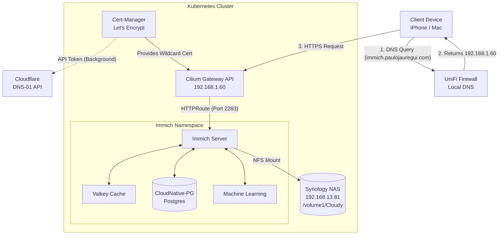

# Immich Architecture & GitOps Reference

This document serves as the canonical reference for the Immich deployment within the Kubernetes GitOps environment. It is designed to provide immediate architectural context and troubleshooting playbooks for future LLM or engineering interactions.

## High-Level Architecture

The Immich stack is deployed via ArgoCD using Kustomize and runs on an Oracle Cloud Infrastructure (OCI) / local hybrid Kubernetes cluster using Cilium for networking.

## 1. Networking & Security (Split-Horizon DNS)

To bypass strict Apple iOS network restrictions without exposing personal photos to the public internet, the network utilizes a **Split-Horizon DNS** architecture with a DNS-01 Let's Encrypt challenge.

* **Domain:** `immich.paulojauregui.com`
* **Certificate Authority:** Let's Encrypt (via `cert-manager` `letsencrypt-prod` ClusterIssuer).
* **Validation:** Cloudflare DNS-01 challenge. This allows the cluster to acquire a valid public certificate *without* opening inbound ports to the internet.
* **Routing:** The Cilium `homelab-gateway` terminates TLS using a wildcard `*.paulojauregui.com` certificate. The local UniFi firewall contains an `A` record routing `immich` directly to the Gateway IP (`192.168.1.60`). 

> [!IMPORTANT]
> **Apple Ecosystem Quirks**
> 1. **Do not use `.local` domains:** Apple's mDNSResponder strictly reserves `.local` for Bonjour multicast. iOS and macOS will ignore UniFi DNS and drop packets if a centralized service uses a `.local` domain.
> 2. **iCloud Private Relay & IP Tracking:** Apple devices will occasionally bypass UniFi DNS entirely if "Limit IP Address Tracking" or "iCloud Private Relay" is enabled on the Wi-Fi network, resulting in a "Server cannot be found" error.
> 3. **Self-Signed Certificates:** Modern iOS Immich apps fundamentally reject self-signed certificates for video streaming. A valid Let's Encrypt certificate (or plain HTTP) is mandatory.

## 2. Storage & Persistence (NFS)

Immich stores all high-volume media (photos, videos, encoded assets) on a Synology NAS via NFS.

* **NFS Target:** `192.168.13.81`
* **Path:** `/volume1/Cloudy`
* **K8s Manifest:** `02-storage.yaml`

> [!WARNING]
> **Immutable Persistent Volumes**
> Kubernetes `nfs.server` and `nfs.path` fields on PersistentVolumes (PVs) are strictly immutable. If the NAS IP changes, updating the GitOps manifest will cause ArgoCD synchronization errors. You must forcefully delete the existing PV and PVC (`kubectl delete pv/pvc ... --force`) to allow ArgoCD to recreate them pointing to the new IP.

## 3. Database (CloudNative-PG)

Immich relies on PostgreSQL with extensive Vector extensions for Machine Learning (facial recognition, smart search). This is managed by the CloudNative-PG (CNPG) operator.

* **Image:** `ghcr.io/tensorchord/cloudnative-vectorchord`
* **Required Extensions:** `vector`, `vchord`, `cube`, `earthdistance`.
* **K8s Manifest:** `04-postgres-cnpg.yaml`

> [!TIP]
> **Day-1 vs Day-2 Extension Loading**
> The `postInitSQL` block in the CNPG manifest only executes on *Day 1* (initial database bootstrap). If a database is already running, adding extensions to the manifest does nothing. You must execute `CREATE EXTENSION` manually by exec-ing into the active postgres pod as the `postgres` superuser.

## 4. Disaster Recovery & Migrations

When restoring an Immich database from a NAS or external source via `pg_dump / pg_restore`, adhere to the following sequence to prevent migration lockouts:

1. **Scale Down:** Scale `immich-server` and `immich-machine-learning` to `0` replicas.
2. **Wipe Schema:** Exec into the DB pod and execute `DROP SCHEMA public CASCADE; CREATE SCHEMA public;`.
3. **Restore:** Execute `pg_restore` (Ensure you omit the `-t` pseudo-TTY flag in Docker/Kubectl exec to prevent binary payload corruption via CRLF injection).
4. **Scale Up:** Scale the applications back to `1`.

> [!CAUTION]
> **Kysely Migration Caching**
> The Immich Node.js backend executes Kysely schema migrations *only once* on startup. If you restore an old database dump while the `immich-server` pod is already running (or if it crashes and restarts mid-restore), it will cache the old migration state and fail to apply the missing schema updates, resulting in missing columns (e.g., `clusterGroupId`). **Always execute a hard restart (`kubectl rollout restart deployment immich-server`) after a database restore.**

## 5. GitOps Manifest Directory Structure

Location: `apps/base/immich/`
* `00-namespace.yaml`: Namespace definition.
* `01-external-secret.yaml`: Doppler integration for `IMMICH_DB_PASSWORD`.
* `02-storage.yaml`: NFS and local PVC definitions.
* `03-valkey.yaml`: Redis-compatible caching layer.
* `04-postgres-cnpg.yaml`: CloudNative-PG Cluster Definition.
* `05-immich-ml.yaml`: Machine Learning microservice.
* `06-immich-server.yaml`: Core monolithic backend and frontend.
* `07-httproute.yaml`: Cilium Gateway API routing rules.
