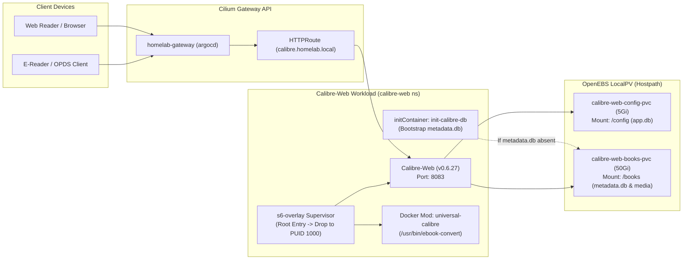

# Calibre-Web: Operations & Maintenance Guide

This runbook documents the deployment topology, SQLite storage architecture, supervisor permissions, external converter configuration, and operational playbooks for **Calibre-Web** on the local K3s cluster.

---

## 1. System Topology & Architecture

Calibre-Web is deployed using LinuxServer's container image (`ghcr.io/linuxserver/calibre-web:latest`), managed by the **S6-overlay** process supervisor, with dynamic converter tooling injected via LinuxServer Docker Mods.



### 1.1 Workload Specifications

| Parameter | Configuration | Notes |
| :--- | :--- | :--- |
| **Namespace** | `calibre-web` | Dedicated namespace for isolation. |
| **Base Manifests** | [`apps/base/calibre-web/`](../../apps/base/calibre-web/) | GitOps declarative source. |
| **Overlay Manifests** | [`apps/overlays/home/calibre-web/`](../../apps/overlays/home/calibre-web/) | Target path for ArgoCD `dev-app-calibre-web`. |
| **Container Image** | `ghcr.io/linuxserver/calibre-web:latest` | Standard homelab distribution with S6-overlay. |
| **Replicas & Strategy** | `1` / `Recreate` | Mandatory for SQLite single-writer POSIX locking. |
| **Process Supervisor** | `s6-overlay` | Drops privileges to `PUID: 1000` / `PGID: 1000`. |
| **Service Port** | `8083` (ClusterIP) | HTTP endpoint. |
| **Routing Hostname** | `calibre.homelab.local` | Gateway API HTTPRoute on `homelab-gateway`. |

---

## 2. Storage & SQLite Concurrency Model

### 2.1 Dual-Database Schema
Calibre-Web decouples user management from the Calibre library schema across two distinct SQLite databases:
1. **`/config/app.db` (5Gi LocalPV):** Contains Calibre-Web application users, hashed credentials, reading sessions, progress markers, and custom book shelves.
2. **`/books/metadata.db` (50Gi LocalPV):** The canonical desktop Calibre library database containing book metadata, author relations, tag taxonomies, and format links.

### 2.2 Native POSIX Locking vs. Network Shares
SQLite relies fundamentally on POSIX advisory file locks (`fcntl`/`flock`).
- **Why NFS/SMB is avoided:** Mounting SQLite databases across network filesystems (NFSv3, NFSv4, SMB) frequently results in stale locks, silent index corruption, and fatal `database is locked` runtime exceptions.
- **OpenEBS LocalPV (`openebs-hostpath`):** Provides direct host-level filesystem access on local ext4/xfs storage, guaranteeing zero lock latency and reliable POSIX locking.
- **Concurrency Rule:** `replicas: 1` with `strategy: type: Recreate` must be enforced. Concurrent write transactions from multiple pods will immediately corrupt SQLite state.

---

## 3. Container Lifecycle & Security Architecture

### 3.1 S6-Overlay Permission Lifecycle
The `linuxserver/calibre-web` image relies on S6-overlay to prepare the runtime environment on boot.

```
[Container Boot (UID 0)]
   │
   ├─► Evaluate Linux capabilities (CHOWN, SETUID, SETGID, DAC_OVERRIDE, FOWNER)
   ├─► Download and unpack Docker Mod: linuxserver/mods:universal-calibre
   ├─► Set file permissions across /config and /books
   ├─► Drop execution context to unprivileged user (PUID: 1000, PGID: 1000)
   │
   ▼
[Calibre-Web Webapp Executed as UID 1000]
```

> [!WARNING]
> Do not configure `runAsNonRoot: true` in the Kubernetes pod `securityContext`. S6-overlay must execute its initial entrypoint as root to install Docker mods and manage ownership before dropping to UID 1000. Setting `runAsNonRoot: true` triggers an immediate `Operation not permitted` crash loop.

### 3.2 Idempotent Empty Library Bootstrap
Upstream Calibre-Web crashes on clean deployments if `/books/metadata.db` does not exist. An `initContainer` (`init-calibre-db`) using `curlimages/curl:8.10.1` checks for the database:
```sh
if [ ! -f /books/metadata.db ]; then
  echo "metadata.db not found. Fetching empty template from upstream..."
  curl -fsSL -o /books/metadata.db https://github.com/janeczku/calibre-web/raw/master/library/metadata.db
  chmod 664 /books/metadata.db
else
  echo "metadata.db already exists. Skipping bootstrap."
fi
```
This guarantees fully automated GitOps deployment without requiring manual file placement on the storage node.

---

## 4. External Converter Configuration Guide

Calibre-Web uses external command-line tools to convert books between formats (e.g., EPUB ↔ MOBI / AZW3 / PDF).

### 4.1 Required Admin UI Settings
In the Calibre-Web web interface, navigate to **Admin > Basic Configuration > External Binaries**:

| Field | Configuration | Notes |
| :--- | :--- | :--- |
| **Path to Calibre Binaries** | `/usr/bin/` | **Directory path** containing `ebook-convert`. Must include the trailing slash or folder path. |
| **Calibre E-Book Converter Settings** | *(Leave Blank)* | For custom CLI flags only (e.g., `--enable-heuristics`). Leaving a path here causes a command syntax failure. |
| **Path to Kepubify E-Book Converter** | *(Leave Blank)* | **Must be cleared**. Kepubify is not packaged in `universal-calibre`. If populated, validation halts with `Kepubify binary not found`. |
| **Location of Unrar binary** | `/usr/bin` | Default directory path where `unrar` executable is resolved for comic books (CBR). |

---

## 5. Adding & Ingesting Books

### 5.1 Web UI Upload
1. Log in to Calibre-Web as an administrator.
2. Go to **Admin > Edit User Profile** for your account and check **Allow Uploads**.
3. A **Upload Format** button will appear in the top navigation bar to ingest EPUB, PDF, MOBI, and other formats directly.

### 5.2 Calibre Desktop Content Server Sync
To sync directly from your desktop Calibre library to the homelab cluster:
1. In Calibre-Web, go to **Admin > Basic Configuration > Server Configuration**.
2. Note the OPDS feed URL: `https://calibre.homelab.local/opds`.
3. In desktop Calibre or mobile reading apps (e.g., Apple Books, Moon+ Reader, FBReader, Kobo), configure the catalog feed with your credentials.

---

## 6. Upstream Version Upgrades

1. Read release notes at [github.com/janeczku/calibre-web/releases](https://github.com/janeczku/calibre-web/releases).
2. Update the image tag in [`apps/base/calibre-web/02-deployment.yaml`](../../apps/base/calibre-web/02-deployment.yaml).
3. Validate and push:
   ```bash
   kubectl kustomize apps/overlays/home/calibre-web
   git add apps/base/calibre-web/02-deployment.yaml
   git commit -m "chore(calibre-web): bump image to latest"
   git push origin main
   ```
4. Verify S6 supervisor startup and mod re-injection:
   ```bash
   kubectl logs -n calibre-web -l app=calibre-web -c calibre-web | grep -E "(universal-calibre|ebook-convert)"
   ```

---

## 7. Troubleshooting & Operational Playbook

### 7.1 "Kepubify binary not found" Error on Save
- **Cause:** Calibre-Web attempts to validate `/usr/bin/kepubify`, which is not part of the standard `universal-calibre` mod.
- **Resolution:** Navigate to **Admin > Basic Configuration > External Binaries**, clear the **Path to Kepubify E-Book Converter** field completely, and click **Save**.

### 7.2 "database is locked" (SQLite Lock Contention)
- **Symptom:** Web UI displays 500 error or logs report `sqlite3.OperationalError: database is locked`.
- **Causes:**
  1. Multiple pods were scheduled against the same volume (verify `replicas: 1` and `strategy: type: Recreate`).
  2. A long-running conversion or backup task locked the SQLite table.
- **Resolution:**
  ```bash
  # Restart the pod cleanly to release stuck file handles
  kubectl rollout restart deployment -n calibre-web calibre-web
  ```

### 7.3 Repairing Library File Permissions
If files uploaded directly to the node have invalid permissions:
```bash
kubectl exec -it -n calibre-web -l app=calibre-web -c calibre-web -- chown -R abc:abc /books /config
```
*(User `abc` corresponds to UID/GID 1000 managed by S6-overlay).*

### 7.4 Upload Size Failures (Large E-Books / Graphic Novels)
- **Symptom:** Large PDF or CBR uploads (>50MB) fail with `413 Request Entity Too Large`.
- **Resolution:** If proxying through an external tunnel or reverse proxy (e.g., Cloudflare Tunnel), adjust `client_max_body_size` or tunnel ingress rules to permit at least 250MB payloads.
