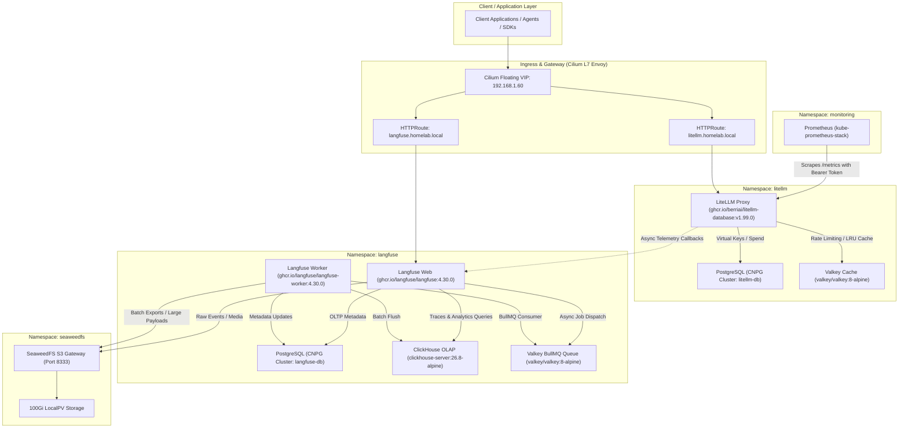

# Langfuse & LiteLLM Gateway Runbook

This document provides architectural specifications, dependency graphs, bootstrap procedures, and operational runbooks for the AI proxy and LLM observability stack deployed on the **K3s Homelab Cluster** (`home`).

---

## 1. Architectural Overview & Mental Model

The AI inference infrastructure couples **LiteLLM Gateway** (a high-performance unified LLM reverse proxy) with **Langfuse** (an enterprise-grade OpenTelemetry-native LLM engineering and observability platform).



### Component Breakdown
1. **LiteLLM Gateway (`litellm`):**
   - Single unified endpoint compatible with OpenAI schema (`/v1/chat/completions`, `/v1/embeddings`).
   - Handles intelligent router fallback, usage tracking, virtual tenant keys, and token-bucket rate limiting.
   - Background telemetry thread forwards execution spans and cost metrics to Langfuse asynchronously.
2. **Langfuse (`langfuse`):**
   - **Web Container:** Next.js application handling the interactive console, API routes, user authentication, and real-time dashboard analytics.
   - **Worker Container:** Node.js background worker executing heavy asynchronous BullMQ jobs, ClickHouse batch migrations, and telemetry stream aggregation.
   - **ClickHouse Server (26.8 LTS):** Columnar analytical engine storing high-throughput observation logs, generation traces, and score aggregations.
   - **CloudNativePG (`langfuse-db`):** Relational transactional store for organizations, projects, users, and cryptographic API keys.
   - **SeaweedFS S3:** Cluster-wide S3-compatible blob store backed by 100Gi storage for persisting trace payloads exceeding transactional limits.

---

## 2. Ingress & Networking Specifications

| Service | Subdomain | Internal Cluster Service | Exposed Ports | Ingress Controller |
| :--- | :--- | :--- | :--- | :--- |
| **LiteLLM** | `litellm.homelab.local` | `litellm.litellm.svc:4000` | `80` (Redirect), `443` (TLS) | Cilium Gateway API |
| **Langfuse** | `langfuse.homelab.local` | `langfuse-web.langfuse.svc:3000` | `80` (Redirect), `443` (TLS) | Cilium Gateway API |
| **SeaweedFS S3** | In-Cluster Only | `seaweedfs-s3.seaweedfs.svc:8333` | `8333` (S3 API) | Internal CoreDNS |

---

## 3. Bootstrap & Telemetry Pairing Runbook

Follow these sequential steps to complete initial user onboarding and link LiteLLM to Langfuse.

### Step 1: Initial Admin Account & Project Creation
1. Open a browser and navigate to:
   ```text
   https://langfuse.homelab.local
   ```
2. Click **Sign Up** to create the initial root administrative account.
3. Once logged in, click **New Project** and name your project (e.g., `homelab-ai` or `production`).

### Step 2: Generate API Credentials
1. Within your project dashboard, navigate to **Settings** -> **API Keys**.
2. Click **Create new API keys**.
3. Copy the two generated keys:
   - **Public Key:** Begins with `pk-lf-...`
   - **Secret Key:** Begins with `sk-lf-...`

### Step 3: Populate Doppler Vault
1. Update your Doppler configuration (`k8s-eso / dev`):
   ```bash
   doppler secrets set LANGFUSE_PUBLIC_KEY="pk-lf-..." LANGFUSE_SECRET_KEY="sk-lf-..." --project k8s-eso --config dev
   ```
2. The External Secrets Operator will automatically synchronize the secret to `secret/litellm-secrets` in Kubernetes within its refresh window.
3. To trigger an immediate restart:
   ```bash
   kubectl rollout restart deployment/litellm -n litellm
   ```

### Step 4: Verify End-to-End LLM Trace Pipeline
Send a test inference request to LiteLLM with your `LITELLM_MASTER_KEY`:
```bash
# Retrieve master key from Doppler
export LITELLM_KEY=$(doppler secrets get LITELLM_MASTER_KEY --project k8s-eso --config dev --plain)

# Send test completion
curl -X POST https://litellm.homelab.local/v1/chat/completions \
  -H "Authorization: Bearer $LITELLM_KEY" \
  -H "Content-Type: application/json" \
  -d '{
    "model": "gpt-4o",
    "messages": [
      {"role": "user", "content": "Ping"}
    ]
  }'
```
Open **Langfuse Console** (`https://langfuse.homelab.local/project/.../traces`) to verify that the generation span, token counts, latency, and costs appear in real time.

---

## 4. Maintenance & Diagnostic Procedures

### 4.1 Check Pod and Workload Health
```bash
# Verify all Langfuse pods (Web, Worker, Valkey, ClickHouse, Postgres)
kubectl get pods,pvc -n langfuse

# Verify all LiteLLM pods (Proxy, Valkey, Postgres)
kubectl get pods,pvc -n litellm

# Verify SeaweedFS cluster (Master, Volume, Filer, S3)
kubectl get pods,pvc -n seaweedfs
```

### 4.2 Stream Logs
```bash
# LiteLLM Proxy request logs
kubectl logs -n litellm deployment/litellm -f

# Langfuse Web application logs
kubectl logs -n langfuse deployment/langfuse-web -f

# Langfuse Background Worker logs
kubectl logs -n langfuse deployment/langfuse-worker -f
```

### 4.3 Prometheus Metrics Verification
LiteLLM exposes OpenMetrics format on `/metrics` with token authentication:
```bash
kubectl exec -n litellm deployment/litellm -- curl -s http://localhost:4000/metrics | head -n 25
```
Prometheus automatically discovers and scrapes this endpoint via the configured `ServiceMonitor/litellm` using `bearerTokenSecret: litellm-secrets/LITELLM_MASTER_KEY`.
