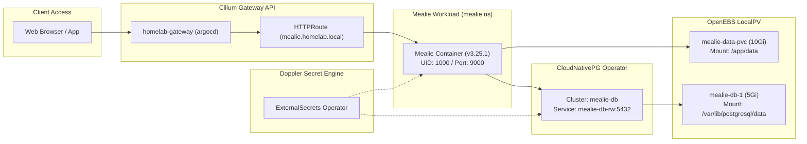

# Mealie: Operations & Maintenance Guide

This runbook documents the deployment architecture, configuration management, upgrade procedures, and disaster recovery playbooks for **Mealie** on the local K3s cluster.

---

## 1. System Topology & Architecture

Mealie is deployed as a single unified container (combining the FastAPI REST backend and Vue 3 frontend) with a dedicated, decoupled relational database tier managed by the **CloudNativePG** operator.



### 1.1 Workload Specifications

| Parameter | Configuration | Notes |
| :--- | :--- | :--- |
| **Namespace** | `mealie` | Dedicated namespace for isolation. |
| **Base Manifests** | [`apps/base/mealie/`](../../apps/base/mealie/) | GitOps declarative source. |
| **Overlay Manifests** | [`apps/overlays/home/mealie/`](../../apps/overlays/home/mealie/) | Target path for ArgoCD `dev-app-mealie`. |
| **Container Image** | `ghcr.io/mealie-recipes/mealie:v3.25.1` | Pinned stable release. |
| **Replicas & Strategy** | `1` / `Recreate` | Prevents multi-attach deadlocks on `openebs-hostpath`. |
| **Execution User** | Non-root (`UID: 1000`, `GID: 1000`) | Enforced by pod `securityContext`. |
| **Service Port** | `9000` (ClusterIP) | HTTP endpoint. |
| **Routing Hostname** | `mealie.homelab.local` | Gateway API HTTPRoute on `homelab-gateway`. |

---

## 2. Persistence & Storage Architecture

Mealie requires two separate storage allocations:

1. **Relational Database (`mealie-db`):** Managed entirely by the CloudNativePG operator. Stores recipe definitions, ingredients, users, meal plans, tags, and full-text search indexes (`pg_trgm`). Backed by a 5Gi `openebs-hostpath` volume.
2. **Media & Assets (`mealie-data-pvc`):** Mounted inside the Mealie container at `/app/data`. Stores scraped recipe imagery, custom theme files, local backup archives, and temporary file uploads. Backed by a 10Gi `openebs-hostpath` volume.

---

## 3. Secret & Credential Management

All secrets are managed in Doppler under project **`k8s-eso`**, configuration **`dev`**.

### 3.1 Doppler Secret Schema
- `MEALIE_DB_PASSWORD`: Password for the PostgreSQL `mealie_user` account.
- `MEALIE_SECRET_KEY`: High-entropy 32-byte hex string used for signing JWT authentication tokens and session state.

### 3.2 Kubernetes Reconciled Secrets
The manifest [`apps/base/mealie/01-external-secret.yaml`](../../apps/base/mealie/01-external-secret.yaml) reconciles two secrets:
1. `mealie-db-credentials` (Type: `kubernetes.io/basic-auth`): Read by the CloudNativePG operator during cluster bootstrap.
2. `mealie-secrets` (Type: `Opaque`): Injected directly into the Mealie application pod as environment variables (`POSTGRES_PASSWORD` and `SECRET_KEY`).

### 3.3 Credential Rotation Procedure
If you need to rotate the database password:
1. Update `MEALIE_DB_PASSWORD` in Doppler:
   ```bash
   doppler secrets set MEALIE_DB_PASSWORD="<new-password>" --project k8s-eso --config dev
   ```
2. Trigger an immediate refresh via ExternalSecrets:
   ```bash
   kubectl annotate externalsecret -n mealie mealie-db-credentials force-sync=$(date +%s) --overwrite
   kubectl annotate externalsecret -n mealie mealie-secrets force-sync=$(date +%s) --overwrite
   ```
3. Update the password inside PostgreSQL via `psql` using the CNPG primary pod:
   ```bash
   kubectl exec -it -n mealie mealie-db-1 -c postgres -- psql -U postgres -c "ALTER USER mealie_user WITH PASSWORD '<new-password>';"
   ```
4. Restart the Mealie application pod:
   ```bash
   kubectl rollout restart deployment -n mealie mealie
   ```

---

## 4. Upstream Version Upgrades

When a new stable release of Mealie is published:

### 4.1 Upgrade Pre-flight Check
1. Read the upstream release notes at [github.com/mealie-recipes/mealie/releases](https://github.com/mealie-recipes/mealie/releases) for breaking changes or database migration warnings.
2. Take a database backup before updating the image tag.

### 4.2 Step-by-Step Upgrade Procedure
1. Edit the image tag in [`apps/base/mealie/04-deployment.yaml`](../../apps/base/mealie/04-deployment.yaml):
   ```yaml
   image: ghcr.io/mealie-recipes/mealie:v<new-version>
   ```
2. Validate the Kustomize build locally:
   ```bash
   kubectl kustomize apps/overlays/home/mealie
   ```
3. Commit and push the change to `main`:
   ```bash
   git add apps/base/mealie/04-deployment.yaml
   git commit -m "chore(mealie): bump image to v<new-version>"
   git push origin main
   ```
4. Monitor the deployment in ArgoCD and inspect the startup logs for database schema migrations (Alembic):
   ```bash
   kubectl logs -n mealie -l app=mealie -f
   ```
   *Expected output:* You should see Alembic running migration revisions followed by `Application startup complete.` on port 9000.

---

## 5. Backup and Disaster Recovery

### 5.1 Application-Level Backups (Mealie UI)
Mealie includes a built-in backup engine that packages recipes, photos, and settings into a `.zip` archive located at `/app/data/backups/`.
- Access: **Settings > Administration > Backups**.
- Click **Create Backup**. Archives can be downloaded directly from the web browser.

### 5.2 Database Logical Dumps (CLI)
To perform an ad-hoc PostgreSQL database dump:
```bash
kubectl exec -n mealie mealie-db-1 -c postgres -- pg_dump -U mealie_user -d mealie -Fc > mealie_backup_$(date +%Y%m%d).dump
```

### 5.3 Database Restore Procedure
If recovering from data corruption:
1. Scale down the Mealie application pod to ensure no active connections:
   ```bash
   kubectl scale deployment -n mealie mealie --replicas=0
   ```
2. Drop and recreate the `mealie` database:
   ```bash
   kubectl exec -it -n mealie mealie-db-1 -c postgres -- psql -U postgres -c "DROP DATABASE mealie;"
   kubectl exec -it -n mealie mealie-db-1 -c postgres -- psql -U postgres -c "CREATE DATABASE mealie OWNER mealie_user;"
   ```
3. Restore from the dump file:
   ```bash
   kubectl exec -i -n mealie mealie-db-1 -c postgres -- pg_restore -U mealie_user -d mealie < mealie_backup.dump
   ```
4. Scale the Mealie deployment back to 1:
   ```bash
   kubectl scale deployment -n mealie mealie --replicas=1
   ```

---

## 6. Troubleshooting & Operational Playbook

### 6.1 Mealie Pod Fails Readiness Probe (`503 Service Unavailable`)
- **Symptom:** Gateway returns `503` or pod remains in `Running (0/1)`.
- **Diagnostic:**
  ```bash
  kubectl describe pod -n mealie -l app=mealie
  kubectl logs -n mealie -l app=mealie --tail=100
  ```
- **Common Cause:** Database is unreachable or still initializing migrations. Check CNPG status:
  ```bash
  kubectl get cluster.postgresql.cnpg.io -n mealie mealie-db
  ```
  Ensure the cluster status is `Cluster in healthy state` and the service `mealie-db-rw` exists.

### 6.2 ExternalSecret Sync Failure
- **Symptom:** `mealie-secrets` or `mealie-db-credentials` secrets do not exist.
- **Diagnostic:**
  ```bash
  kubectl describe externalsecrets.external-secrets.io -n mealie
  ```
- **Resolution:** Verify Doppler token connectivity and ensure the keys `MEALIE_DB_PASSWORD` and `MEALIE_SECRET_KEY` exist in Doppler under `k8s-eso / dev`.

### 6.3 LocalPV Multi-Attach Scheduler Error
- **Symptom:** Pod stuck in `ContainerCreating` with events showing `Multi-Attach error for volume`.
- **Resolution:** Ensure `replicas: 1` and `strategy: type: Recreate` are defined in the Deployment. If a previous pod terminated ungracefully, manually delete the terminating pod with `--force --grace-period=0` to release the node-local volume attachment.
